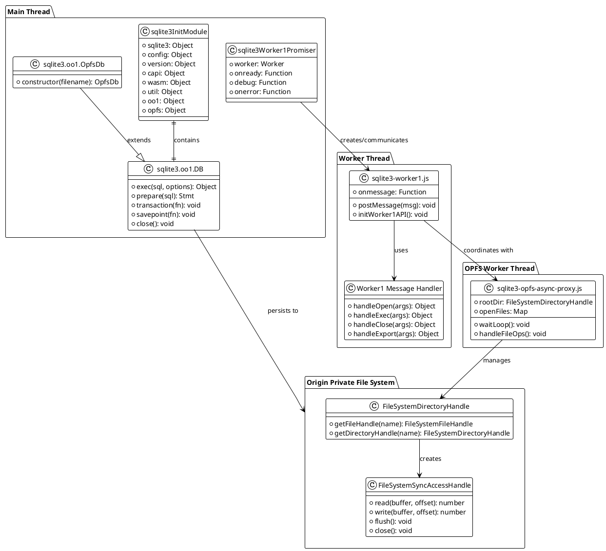
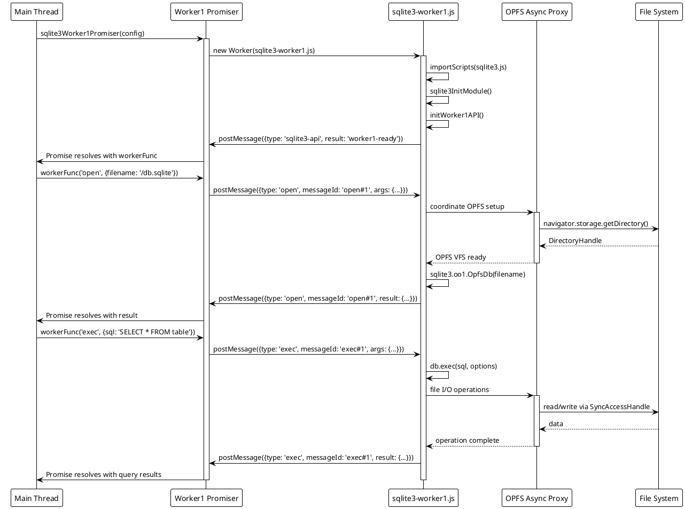

# SQLite3 WASM + OPFS API Guide

This guide explains how to use the SQLite3 WebAssembly bundle shipped in `src/jswasm` with Origin Private File System (OPFS) persistence. It covers module loading, the high-level OO1 API, worker-based access via the promise-friendly Worker #1 adapter, and helper utilities for managing OPFS storage.

## 1. Prerequisites

-   **Serve over HTTP/HTTPS.** Browsers refuse to load `.wasm` modules from `file://` URLs.
-   **Enable SharedArrayBuffer (SAB).** Your server must emit `Cross-Origin-Opener-Policy: same-origin` and `Cross-Origin-Embedder-Policy: require-corp` headers; without them OPFS features remain inaccessible.
-   **Browser support.** You need the OPFS APIs (`navigator.storage.getDirectory`, `FileSystemSyncAccessHandle`, `SharedArrayBuffer`, `Atomics`).
-   **Load the correct bundle.** Import `sqlite3.mjs` for ES modules, `sqlite3.js` for classic scripts, or the `*-bundler-friendly` variants when bundling.

## 2. Architecture Overview

### 2.1 System Component Diagram



### 2.2 Worker Communication Sequence



## 3. Bootstrapping the Module

### 3.1 Basic Module Initialization

```js
import sqlite3InitModule from "./src/jswasm/sqlite3.mjs";

// Initialize the SQLite3 module with configuration options
const sqlite3 = await sqlite3InitModule({
    // Redirect stdout from the WASM module (optional)
    print: console.log,
    // Redirect stderr from the WASM module (optional)
    printErr: console.error,
});

// Verify OPFS VFS is available - critical for persistent storage
if (!sqlite3.opfs) {
    throw new Error("OPFS VFS unavailable. Check COOP/COEP headers.");
}

// Log the loaded SQLite version for debugging
console.log("✅ Loaded SQLite version:", sqlite3.version.libVersion);
// Example output: "✅ Loaded SQLite version: 3.50.4"

// Log available VFS (Virtual File System) options
console.log("📁 Available VFS options:", sqlite3.capi.sqlite3_vfs_find(0));
// Shows which storage backends are available (memory, OPFS, etc.)
```

### 3.2 Module Structure and Available APIs

Once resolved, the returned `sqlite3` namespace exposes:

```js
// Configuration and feature flags
console.log("⚙️ Module configuration:", sqlite3.config);
// Shows: { bigIntEnabled, wasmfsOpfsDir, etc. }

// Version and build information
console.log("📋 Build info:", sqlite3.version);
// Shows: { libVersion, libVersionNumber, sourceId, etc. }

// Low-level C API surface - direct WASM function calls
console.log(
    "🔧 C API available:",
    Object.keys(sqlite3.capi).length,
    "functions"
);
// Direct access to sqlite3_open, sqlite3_exec, etc.

// WebAssembly module instance and memory management
console.log(
    "💾 WASM memory size:",
    sqlite3.wasm.memory.buffer.byteLength,
    "bytes"
);

// Utility functions for type conversion and memory management
console.log("🛠️ Utilities available:", Object.keys(sqlite3.util));
// String conversion, TypedArray helpers, assertions, etc.

// High-level Object-Oriented API (recommended for most use cases)
console.log("🏗️ OO1 API classes:", Object.keys(sqlite3.oo1));
// DB, Stmt, Transaction management classes

// OPFS integration (available after async initialization)
if (sqlite3.opfs) {
    console.log("💿 OPFS utilities ready:", Object.keys(sqlite3.opfs));
    // File system operations, import/export, metrics
}
```

## 4. High-Level OO1 API with OPFS

### 4.1 Database Creation and Management

```js
// Create a persistent OPFS database
const db = new sqlite3.oo1.OpfsDb("/databases/tasks.db");
console.log("📂 Created OPFS database at:", db.filename);
// Output: "📂 Created OPFS database at: /databases/tasks.db"

// Alternative: Create in-memory database for temporary operations
const memoryDb = new sqlite3.oo1.DB(":memory:");
console.log("💭 Created in-memory database");

// Alternative: Specify custom options
const customDb = new sqlite3.oo1.DB({
    filename: "/custom/path.db",
    flags: "c", // create if not exists
    vfs: "opfs", // explicitly specify OPFS VFS
});
console.log("⚙️ Created custom database with flags:", customDb.filename);
```

`OpfsDb` extends `sqlite3.oo1.DB`, automatically using the `opfs` VFS and setting a 10-second busy timeout for better concurrency handling.

### 4.2 Schema Creation and Data Manipulation

```js
// Create table schema - will persist in OPFS
db.exec(`
  CREATE TABLE IF NOT EXISTS todo (
    id INTEGER PRIMARY KEY AUTOINCREMENT,
    title TEXT NOT NULL,
    description TEXT,
    done INTEGER NOT NULL DEFAULT 0,
    created_at DATETIME DEFAULT CURRENT_TIMESTAMP
  )
`);
console.log("✅ Table schema created successfully");

// Insert data with parameter binding for security
const insertResult = db.exec({
    sql: "INSERT INTO todo(title, description, done) VALUES (?, ?, ?)",
    bind: ["Write comprehensive docs", "Add UML diagrams and examples", 0],
    returnValue: "this", // Return the db object for chaining
    lastInsertRowId: true, // Include the new row ID in result
    countChanges: true, // Include number of affected rows
});

console.log("📝 Inserted new todo with ID:", insertResult.lastInsertRowId);
// Output: "📝 Inserted new todo with ID: 1"
console.log("📊 Rows affected:", insertResult.changeCount);
// Output: "📊 Rows affected: 1"

// Batch insert multiple records efficiently
const todos = [
    ["Review code architecture", "Analyze all core components", 1],
    ["Create UML diagrams", "Design system and sequence diagrams", 0],
    ["Enhance documentation", "Add detailed comments and examples", 0],
];

todos.forEach((todo, index) => {
    db.exec({
        sql: "INSERT INTO todo(title, description, done) VALUES (?, ?, ?)",
        bind: todo,
    });
    console.log(`➕ Added todo ${index + 1}:`, todo[0]);
});
```

### 4.3 Querying Data with Different Output Formats

```js
// Query with automatic result collection
const allTodos = db.exec({
    sql: "SELECT id, title, done FROM todo ORDER BY id",
    rowMode: "object", // Return rows as objects with column names as keys
    resultRows: [], // Collect all rows into this array
}).resultRows;

console.log("📋 All todos retrieved:", allTodos.length, "items");
console.table(allTodos);
// Outputs a formatted table showing all todo items

// Query with streaming callback for large datasets
let completedCount = 0;
db.exec({
    sql: "SELECT id, title, done FROM todo WHERE done = ?",
    bind: [1], // Find completed todos
    rowMode: "object",
    callback: (row, stmt) => {
        console.log(`✅ Completed: ${row.id} - ${row.title}`);
        completedCount++;
    },
});
console.log(`📈 Total completed todos: ${completedCount}`);

// Query single value efficiently
const totalTodos = db.selectValue("SELECT COUNT(*) FROM todo");
console.log("🔢 Total todo count:", totalTodos);

// Query with different row modes
console.log("\n🔍 Different query result formats:");

// Array mode (default) - rows as arrays
const arrayRows = db.exec({
    sql: "SELECT title, done FROM todo LIMIT 2",
    rowMode: "array",
    resultRows: [],
}).resultRows;
console.log("📊 Array format:", arrayRows);
// Output: [["Write comprehensive docs", 0], ["Review code architecture", 1]]

// Object mode - rows as objects with column names
const objectRows = db.exec({
    sql: "SELECT title, done FROM todo LIMIT 2",
    rowMode: "object",
    resultRows: [],
}).resultRows;
console.log("🏷️ Object format:", objectRows);
// Output: [{title: "Write comprehensive docs", done: 0}, {...}]

// Column index mode - extract specific column
const titleRows = db.exec({
    sql: "SELECT title, done FROM todo LIMIT 2",
    rowMode: 0, // Extract column 0 (title)
    resultRows: [],
}).resultRows;
console.log("📝 Title column only:", titleRows);
// Output: ["Write comprehensive docs", "Review code architecture"]

// Column name mode - extract by name
const doneFlags = db.exec({
    sql: "SELECT title, done FROM todo LIMIT 2",
    rowMode: "$done", // Extract 'done' column
    resultRows: [],
}).resultRows;
console.log("✅ Done flags only:", doneFlags);
// Output: [0, 1]
```

`DB.exec()` accepts comprehensive options:

-   `sql`: string or array (multiple statements automatically `;`-joined)
-   `bind`: single value, array, or object for parameter binding
-   `rowMode`: `'array'`, `'object'`, column index, or `'$columnName'`
-   `resultRows`: array to automatically collect rows
-   `callback(row, stmt)`: streaming row handler for large datasets
-   `lastInsertRowId`, `countChanges`: include metadata in the result object

### 4.4 Prepared Statements for Performance

```js
// Create a prepared statement for repeated execution
const stmt = db.prepare("SELECT title, description FROM todo WHERE done = ?");
console.log("📋 Prepared statement created");

try {
    // Execute with different parameters
    console.log("\n🔄 Executing prepared statement multiple times:");

    // Find incomplete todos
    stmt.bind([0]); // Bind parameter: done = 0
    let incompleteCount = 0;
    while (stmt.step()) {
        const title = stmt.getString(0); // Get column 0 as string
        const desc = stmt.getString(1); // Get column 1 as string
        console.log(`⏳ Incomplete: ${title} - ${desc}`);
        incompleteCount++;
    }
    console.log(`📊 Found ${incompleteCount} incomplete todos`);

    // Reset and query completed todos
    stmt.reset(); // Reset statement for reuse
    stmt.bind([1]); // Bind parameter: done = 1
    let completedCount = 0;
    while (stmt.step()) {
        const title = stmt.getString(0);
        console.log(`✅ Completed: ${title}`);
        completedCount++;
    }
    console.log(`📊 Found ${completedCount} completed todos`);

    // Demonstrate different getter methods
    stmt.reset();
    stmt.bind([0]);
    if (stmt.step()) {
        console.log("\n🔍 Statement getter methods:");
        console.log("📝 Title (string):", stmt.getString(0));
        console.log("📋 Description (string):", stmt.getString(1));
        console.log("🏷️ Column names:", stmt.getColumnNames());
        // Output: ["title", "description"]
        console.log("🔢 Column count:", stmt.columnCount);
        console.log("📖 Statement is read-only:", stmt.isReadOnly);
    }
} finally {
    // Always finalize prepared statements to free resources
    stmt.finalize();
    console.log("🧹 Prepared statement finalized");
}
```

`Stmt` exposes comprehensive methods:

-   `bind(values)`: bind parameters by index or name
-   `step()`: execute and advance to next row (returns boolean)
-   `get*()`: type-specific getters (`get`, `getInt`, `getFloat`, `getBlob`, `getJSON`)
-   `getString(index)`, `getInt(index)`: column value extraction
-   `getColumnNames()`: array of column names
-   `reset()`: reset for re-execution
-   `clearBindings()`: clear all parameter bindings
-   `finalize()`: clean up resources (critical for memory management)

### 4.5 Transaction Management

```js
// Atomic transaction - all operations succeed or all fail
console.log("\n💾 Demonstrating transaction management:");

try {
    db.transaction(() => {
        console.log("🔄 Starting transaction...");

        // Multiple operations within transaction
        db.exec({
            sql: "UPDATE todo SET done = 1 WHERE id = ?",
            bind: [1],
        });
        console.log("✅ Updated todo 1 to completed");

        db.exec({
            sql: "INSERT INTO todo(title, done) VALUES (?, ?)",
            bind: ["Transaction test", 1],
        });
        console.log("➕ Added new todo within transaction");

        const count = db.selectValue(
            "SELECT COUNT(*) FROM todo WHERE done = 1"
        );
        console.log("📊 Completed todos in transaction:", count);

        // Transaction commits automatically if no exceptions thrown
    });
    console.log("✅ Transaction committed successfully");
} catch (error) {
    console.error("❌ Transaction failed and was rolled back:", error.message);
}

// Nested savepoints for fine-grained control
console.log("\n🔄 Demonstrating nested savepoints:");

try {
    db.savepoint(() => {
        console.log("📍 Created outer savepoint");

        db.exec(
            "UPDATE todo SET description = 'Modified in savepoint' WHERE id = 1"
        );
        console.log("✏️ Modified todo in outer savepoint");

        // Nested savepoint
        try {
            db.savepoint(() => {
                console.log("📍 Created inner savepoint");

                db.exec("DELETE FROM todo WHERE id = 1");
                console.log("🗑️ Deleted todo in inner savepoint");

                // Simulate an error to trigger rollback
                throw new Error("Simulated inner savepoint error");
            });
        } catch (innerError) {
            console.log("↩️ Inner savepoint rolled back:", innerError.message);
        }

        // Outer savepoint continues - inner changes rolled back
        const todo = db.exec({
            sql: "SELECT title, description FROM todo WHERE id = 1",
            rowMode: "object",
            resultRows: [],
        }).resultRows[0];

        if (todo) {
            console.log(
                "✅ Todo still exists after inner rollback:",
                todo.title
            );
            console.log("📝 Description updated:", todo.description);
        }
    });
    console.log("✅ Outer savepoint committed");
} catch (error) {
    console.error("❌ Savepoint operation failed:", error.message);
}
```

## 5. Worker #1 Promiser API

For CPU-intensive operations or to avoid blocking the UI thread, run SQLite in a dedicated worker using the Promise-friendly adapter.

### 5.1 Worker Initialization and Configuration

```js
import promiserFactory from "./src/jswasm/sqlite3-worker1-promiser.mjs";

// Configure the worker with comprehensive options
const workerConfig = {
    // Debug logging (optional) - helps troubleshoot worker communication
    debug: (...args) => console.debug("🔧 [worker debug]", ...args),

    // Error handling for worker-level errors
    onerror: (error) => console.error("❌ [worker error]", error),

    // Handle unexpected messages from worker
    onunhandled: (event) =>
        console.warn("⚠️ [unhandled worker message]", event.data),

    // Optional: Custom worker factory (defaults to sqlite3-worker1-bundler-friendly.mjs)
    worker: () =>
        new Worker(
            new URL("sqlite3-worker1-bundler-friendly.mjs", import.meta.url),
            { type: "module" }
        ),
};

// Initialize worker and wait for ready state
console.log("🚀 Initializing SQLite worker...");
const worker = await promiserFactory(workerConfig);
console.log("✅ Worker initialized and ready for commands");
```

### 5.2 Database Operations via Worker Messages

```js
// Open database - this creates the file in OPFS if it doesn't exist
console.log("📂 Opening database in worker...");
const openResult = await worker("open", {
    filename: "/databases/worker-tasks.db",
    // Optional: simulate error for testing
    simulateError: false,
});

console.log("✅ Database opened successfully:");
console.log("  📄 Database ID:", openResult.result.dbId);
console.log("  📁 Filename:", openResult.result.filename);
console.log("  💾 VFS type:", openResult.result.vfs);
console.log("  💿 Persistent storage:", openResult.result.persistent);

// Create schema in worker database
console.log("\n🏗️ Creating database schema...");
await worker("exec", {
    sql: `
    CREATE TABLE IF NOT EXISTS worker_tasks (
      id INTEGER PRIMARY KEY AUTOINCREMENT,
      title TEXT NOT NULL,
      category TEXT DEFAULT 'general',
      priority INTEGER DEFAULT 1,
      completed BOOLEAN DEFAULT FALSE,
      created_at DATETIME DEFAULT CURRENT_TIMESTAMP
    );
    
    CREATE INDEX IF NOT EXISTS idx_priority ON worker_tasks(priority);
    CREATE INDEX IF NOT EXISTS idx_completed ON worker_tasks(completed);
  `,
});
console.log("✅ Database schema created successfully");

// Insert test data with parameter binding
console.log("\n📝 Inserting test data...");
const insertResults = await worker("exec", {
    sql: "INSERT INTO worker_tasks(title, category, priority) VALUES (?, ?, ?)",
    bind: ["Process large dataset", "data-processing", 3],
    lastInsertRowId: true,
    countChanges: true,
});

console.log("➕ Inserted task with:");
console.log("  🆔 ID:", insertResults.result.lastInsertRowId);
console.log("  📊 Rows affected:", insertResults.result.changeCount);

// Batch insert multiple tasks
const tasks = [
    ["Generate reports", "reporting", 2],
    ["Backup database", "maintenance", 1],
    ["Update documentation", "docs", 2],
    ["Performance testing", "testing", 3],
];

for (const [title, category, priority] of tasks) {
    await worker("exec", {
        sql: "INSERT INTO worker_tasks(title, category, priority) VALUES (?, ?, ?)",
        bind: [title, category, priority],
    });
    console.log(`➕ Added task: ${title} (${category}, priority: ${priority})`);
}
```

### 5.3 Querying with Different Result Formats

```js
// Query all tasks with object format
console.log("\n🔍 Querying all tasks...");
const allTasksQuery = await worker("exec", {
    sql: "SELECT id, title, category, priority, completed FROM worker_tasks ORDER BY priority DESC, id",
    rowMode: "object", // Return rows as objects
    resultRows: [], // Collect results into array
});

const allTasks = allTasksQuery.result.resultRows;
console.log(`📋 Retrieved ${allTasks.length} tasks:`);
console.table(allTasks);

// Query with streaming callback for large datasets
console.log("\n📊 High-priority tasks (using streaming callback):");
let highPriorityCount = 0;

const streamQuery = await worker("exec", {
    sql: "SELECT id, title, priority FROM worker_tasks WHERE priority >= ? ORDER BY priority DESC",
    bind: [2],
    rowMode: "object",
    // Streaming callback - called for each row
    callback: (row) => {
        console.log(
            `🔥 Priority ${row.priority}: ${row.title} (ID: ${row.id})`
        );
        highPriorityCount++;
    },
});

console.log(`📈 Total high-priority tasks: ${highPriorityCount}`);

// Query with aggregation
console.log("\n📈 Task statistics by category:");
const statsQuery = await worker("exec", {
    sql: `
    SELECT 
      category,
      COUNT(*) as total_tasks,
      AVG(priority) as avg_priority,
      SUM(CASE WHEN completed THEN 1 ELSE 0 END) as completed_tasks
    FROM worker_tasks 
    GROUP BY category 
    ORDER BY avg_priority DESC
  `,
    rowMode: "object",
    resultRows: [],
});

console.log("📊 Statistics by category:");
statsQuery.result.resultRows.forEach((stat) => {
    console.log(`  📁 ${stat.category}:`);
    console.log(`     📋 Total: ${stat.total_tasks}`);
    console.log(`     ⭐ Avg Priority: ${stat.avg_priority.toFixed(1)}`);
    console.log(
        `     ✅ Completed: ${stat.completed_tasks}/${stat.total_tasks}`
    );
});
```

### 5.4 Advanced Worker Operations

```js
// Export database to binary format
console.log("\n💾 Exporting database...");
const exportResult = await worker("export");
console.log("📦 Database exported:");
console.log("  📄 Filename:", exportResult.result.filename);
console.log("  📊 Size:", exportResult.result.byteArray.length, "bytes");
console.log("  🏷️ MIME type:", exportResult.result.mimetype);

// You can save the exported data
const blob = new Blob([exportResult.result.byteArray], {
    type: exportResult.result.mimetype,
});
console.log("💿 Created blob for download/storage:", blob.size, "bytes");

// Get worker configuration info
console.log("\n⚙️ Worker configuration:");
const configResult = await worker("config-get");
console.log("🔧 Worker config:", configResult.result);
console.log("  🔢 BigInt support:", configResult.result.bigIntEnabled);
console.log("  📋 SQLite version:", configResult.result.version);
console.log("  💾 Available VFS:", configResult.result.vfsList);

// Update tasks to demonstrate change tracking
console.log("\n✏️ Updating tasks...");
const updateResult = await worker("exec", {
    sql: "UPDATE worker_tasks SET completed = TRUE WHERE priority >= ?",
    bind: [3], // Mark high-priority tasks as completed
    countChanges: true,
});

console.log(
    `✅ Updated ${updateResult.result.changeCount} high-priority tasks to completed`
);

// Close database when finished
console.log("\n🔒 Closing database...");
const closeResult = await worker("close", {
    unlink: false, // Keep the file (set to true to delete)
});

console.log("✅ Database closed:", closeResult.result.filename);
console.log("🏁 Worker operations completed successfully");
```

### 5.5 Message Types Reference

The worker supports these message types with their respective arguments and results:

| Message Type | Purpose              | Key Arguments                        | Result Highlights                              |
| ------------ | -------------------- | ------------------------------------ | ---------------------------------------------- |
| `open`       | Open/create database | `filename`, `vfs?`, `simulateError?` | `dbId`, `filename`, `vfs`, `persistent`        |
| `close`      | Close database       | `unlink?` (delete file)              | `filename`                                     |
| `exec`       | Execute SQL          | Mirrors `DB.exec` options            | `resultRows`, `changeCount`, `lastInsertRowId` |
| `config-get` | Get worker config    | none                                 | `bigIntEnabled`, `version`, `vfsList`          |
| `export`     | Export DB to binary  | none                                 | `byteArray`, `filename`, MIME type             |
| `toss`       | Test error handling  | none                                 | Propagated error payload                       |

**Row Callback Messages**: When using streaming callbacks, the worker sends intermediate messages:

```js
{
  type: 'messageId:row',
  rowNumber: 1,           // 1-based row number
  row: {...},            // Row data in specified format
  columnNames: [...]     // Array of column names
}
```

The final message has `rowNumber: null` to indicate end of results.

## 6. OPFS Utilities (`sqlite3.opfs`)

The async VFS provides powerful utility functions for managing the Origin Private File System once initialized.

### 6.1 File System Operations

```js
// Check if the OPFS utilities are available
if (!sqlite3.opfs) {
    throw new Error("OPFS utilities not available - check COOP/COEP headers");
}

console.log("💿 OPFS utilities available:", Object.keys(sqlite3.opfs));

// Check if a file or directory exists
const dbExists = await sqlite3.opfs.entryExists("/databases/tasks.db");
console.log("📄 Database exists:", dbExists);
// Output: "📄 Database exists: true" or "📄 Database exists: false"

// Create directory structure
console.log("📁 Creating directory structure...");
await sqlite3.opfs.mkdir("/backups/monthly");
console.log("✅ Directory created: /backups/monthly");

// Create nested directories (automatically creates parent directories)
await sqlite3.opfs.mkdir("/data/exports/csv");
console.log("✅ Nested directories created: /data/exports/csv");

// List all files and directories in OPFS root
console.log("\n🗂️ OPFS directory tree:");
const tree = await sqlite3.opfs.treeList();
console.log(tree);
// Shows complete directory structure with files and subdirectories

// Traverse OPFS with custom callback
console.log("\n🔍 Traversing OPFS with detailed info:");
await sqlite3.opfs.traverse({
    directory: "/", // Start from root (optional, defaults to root)
    recursive: true, // Include subdirectories
    callback: (entry) => {
        const type = entry.kind === "directory" ? "📁" : "📄";
        console.log(`${type} ${entry.name} (${entry.kind})`);

        if (entry.kind === "file") {
            // Additional file information could be accessed here
            console.log(`   📊 Size: ${entry.size || "unknown"} bytes`);
        }
    },
});
```

### 6.2 Database Import and Export Operations

```js
// Import a database from external source
console.log("\n📥 Importing database from external source...");

// Method 1: Import from fetch response
try {
    const response = await fetch("/seed-data.sqlite3");
    if (!response.ok)
        throw new Error(`HTTP ${response.status}: ${response.statusText}`);

    const bytes = new Uint8Array(await response.arrayBuffer());
    console.log("📦 Downloaded database:", bytes.length, "bytes");

    await sqlite3.opfs.importDb("/databases/seed.db", bytes);
    console.log("✅ Database imported successfully to /databases/seed.db");

    // Verify the import
    const exists = await sqlite3.opfs.entryExists("/databases/seed.db");
    console.log("✔️ Import verification:", exists ? "SUCCESS" : "FAILED");
} catch (error) {
    console.error("❌ Import failed:", error.message);
}

// Method 2: Import with async chunk fetcher for large files
console.log("\n📥 Importing large database with chunked transfer...");
const chunkFetcher = async function (offset, size) {
    console.log(`📡 Fetching chunk: offset=${offset}, size=${size}`);

    // This could fetch from any source - HTTP range requests, IndexedDB, etc.
    const response = await fetch("/large-database.sqlite3", {
        headers: {
            Range: `bytes=${offset}-${offset + size - 1}`,
        },
    });

    if (!response.ok) {
        throw new Error(`Chunk fetch failed: ${response.status}`);
    }

    return new Uint8Array(await response.arrayBuffer());
};

try {
    await sqlite3.opfs.importDb("/databases/large.db", chunkFetcher);
    console.log("✅ Large database imported with chunked transfer");
} catch (error) {
    console.error("❌ Chunked import failed:", error.message);
}

// Export database to binary format
console.log("\n📤 Exporting database...");
try {
    const exportedBytes = await sqlite3.opfs.exportFile("/databases/tasks.db");
    console.log("📦 Exported database:", exportedBytes.length, "bytes");

    // Create downloadable blob
    const blob = new Blob([exportedBytes], { type: "application/x-sqlite3" });
    const url = URL.createObjectURL(blob);
    console.log("💾 Download URL created:", url);

    // Create download link (in browser environment)
    if (typeof document !== "undefined") {
        const link = document.createElement("a");
        link.href = url;
        link.download = "tasks-backup.sqlite3";
        link.textContent = "Download Database Backup";
        document.body.appendChild(link);
        console.log("🔗 Download link added to page");
    }
} catch (error) {
    console.error("❌ Export failed:", error.message);
}
```

### 6.3 File Management and Cleanup

```js
// Delete specific files
console.log("\n🗑️ Cleaning up old files...");
try {
    await sqlite3.opfs.unlink("/databases/temp.db");
    console.log("✅ Deleted temporary database");
} catch (error) {
    console.log(
        "ℹ️ Temp database did not exist or could not be deleted:",
        error.message
    );
}

// Delete directory and all contents recursively
try {
    await sqlite3.opfs.unlink("/old-backups", true, false); // recursive=true, throwOnError=false
    console.log("✅ Deleted old backups directory");
} catch (error) {
    console.log("ℹ️ Old backups directory cleanup skipped:", error.message);
}

// Nuclear option: Clear entire OPFS (use with extreme caution!)
console.log("\n⚠️ DANGER: Complete OPFS cleanup available but not executed");
console.log("   To wipe everything: await sqlite3.opfs.rmfr()");
// Uncomment only if you really want to delete everything:
// await sqlite3.opfs.rmfr();
// console.log('💥 Entire OPFS wiped clean');
```

### 6.4 Performance Monitoring and Debugging

```js
// View OPFS operation metrics
console.log("\n📊 OPFS Performance Metrics:");
const metrics = sqlite3.opfs.metrics.dump();
console.log("⏱️ Async operation timing data:", metrics);

// Metrics include timing for various OPFS operations:
// - File open/close operations
// - Read/write operation latencies
// - Directory traversal times
// - Import/export performance

// Reset metrics for clean measurement
sqlite3.opfs.metrics.reset();
console.log("🔄 Performance metrics reset");

// Advanced: Control the OPFS async worker (rarely needed)
console.log("\n🔧 OPFS Worker Control (advanced):");
console.log("   Available debug controls:");
console.log("   - sqlite3.opfs.debug.asyncShutdown() - stop OPFS worker");
console.log("   - sqlite3.opfs.debug.asyncRestart() - restart OPFS worker");

// Example of controlled shutdown (use only for testing/debugging)
if (false) {
    // Set to true only for testing
    console.log("⏸️ Shutting down OPFS async worker...");
    await sqlite3.opfs.debug.asyncShutdown();
    console.log("✅ OPFS worker stopped");

    // Restart if needed
    console.log("🔄 Restarting OPFS async worker...");
    await sqlite3.opfs.debug.asyncRestart();
    console.log("✅ OPFS worker restarted");
}
```

### 6.5 OPFS Utility Functions Reference

The `sqlite3.opfs` namespace provides these key utilities:

| Function                                  | Purpose                           | Parameters                                                  | Returns               |
| ----------------------------------------- | --------------------------------- | ----------------------------------------------------------- | --------------------- |
| `entryExists(path)`                       | Check file/directory existence    | `path: string`                                              | `Promise<boolean>`    |
| `mkdir(path)`                             | Create directory (with parents)   | `path: string`                                              | `Promise<void>`       |
| `unlink(path, recursive?, throwOnError?)` | Delete file/directory             | `path: string, recursive?: boolean, throwOnError?: boolean` | `Promise<void>`       |
| `treeList()`                              | Get complete directory tree       | none                                                        | `Promise<Array>`      |
| `traverse(options)`                       | Walk directory tree with callback | `{directory?, recursive?, callback}`                        | `Promise<void>`       |
| `importDb(path, source)`                  | Import database file              | `path: string, source: Uint8Array \| Function`              | `Promise<void>`       |
| `exportFile(path)`                        | Export file to bytes              | `path: string`                                              | `Promise<Uint8Array>` |
| `rmfr()`                                  | Delete entire OPFS root           | none                                                        | `Promise<void>`       |
| `metrics.dump()`                          | Get performance metrics           | none                                                        | `Object`              |
| `metrics.reset()`                         | Reset performance counters        | none                                                        | `void`                |

## 7. Sync Access Handle Pool VFS (Optional)

The `installOpfsSAHPoolVfs` provides a managed pool of `FileSystemSyncAccessHandle` instances for improved concurrency and performance in high-throughput scenarios.

### 7.1 Pool Installation and Configuration

```js
console.log("🏊 Installing OPFS Sync Access Handle Pool...");

const poolConfig = {
    name: "opfs-sahpool", // VFS name for registration
    initialCapacity: 6, // Number of handles to create initially
    clearOnInit: false, // Whether to clear existing files on startup
    directory: "/pooled-databases", // Optional: subdirectory for pooled files
};

const pool = await sqlite3.installOpfsSAHPoolVfs(poolConfig);

console.log("✅ OPFS SAH Pool installed successfully:");
console.log("  🏷️ VFS Name:", pool.name);
console.log("  🔢 Initial capacity:", poolConfig.initialCapacity);
console.log("  📁 Directory:", poolConfig.directory || "root");

// Check pool status
const capacity = await pool.getCapacity();
console.log("  💾 Current capacity:", capacity, "handles");
```

### 7.2 Using Pooled Databases

```js
// Create databases using the pooled VFS
console.log("\n🏊 Creating pooled databases...");

const PooledDb = pool.OpfsSAHPoolDb; // Specialized DB class for pooled access

// Create multiple databases that can share the handle pool
const databases = [];
for (let i = 1; i <= 3; i++) {
    const db = new PooledDb(`/pooled-databases/pool-db-${i}.sqlite`);
    console.log(`📂 Created pooled database ${i}:`, db.filename);

    // Initialize schema
    db.exec(`
    CREATE TABLE IF NOT EXISTS pool_test_${i} (
      id INTEGER PRIMARY KEY,
      data TEXT,
      timestamp DATETIME DEFAULT CURRENT_TIMESTAMP
    )
  `);

    // Insert test data
    for (let j = 1; j <= 5; j++) {
        db.exec({
            sql: `INSERT INTO pool_test_${i}(data) VALUES (?)`,
            bind: [`Pool ${i} - Record ${j}`],
        });
    }

    databases.push(db);
    console.log(`✅ Database ${i} initialized with test data`);
}

// Demonstrate concurrent operations
console.log("\n🔄 Running concurrent operations across pooled databases...");
const results = await Promise.all(
    databases.map(async (db, index) => {
        // Each database operation can use a different handle from the pool
        const result = db.exec({
            sql: `SELECT COUNT(*) as count FROM pool_test_${index + 1}`,
            rowMode: "object",
            resultRows: [],
        });

        console.log(
            `📊 Database ${index + 1} record count:`,
            result.resultRows[0].count
        );
        return result.resultRows[0].count;
    })
);

console.log(
    "📈 Total records across all pooled databases:",
    results.reduce((a, b) => a + b, 0)
);
```

### 7.3 Pool Management Operations

```js
// Monitor pool usage
console.log("\n📊 Pool status and management:");

// Get list of files managed by the pool
const fileNames = await pool.getFileNames();
console.log("📄 Files in pool:", fileNames);

// Add more capacity if needed
console.log("➕ Expanding pool capacity...");
const addedCapacity = await pool.addCapacity(2); // Add 2 more handles
console.log("✅ Added capacity:", addedCapacity, "new handles");

const newCapacity = await pool.getCapacity();
console.log("📊 New total capacity:", newCapacity, "handles");

// Reserve minimum capacity for critical operations
console.log("🔒 Reserving minimum capacity...");
await pool.reserveMinimumCapacity(4); // Ensure at least 4 handles always available
console.log("✅ Reserved minimum capacity: 4 handles");

// Export a database from the pool
console.log("\n📤 Exporting pooled database...");
try {
    const exportData = await pool.exportFile(
        "/pooled-databases/pool-db-1.sqlite"
    );
    console.log("📦 Exported database size:", exportData.length, "bytes");

    // Create backup blob
    const backupBlob = new Blob([exportData], {
        type: "application/x-sqlite3",
    });
    console.log("💾 Backup blob created:", backupBlob.size, "bytes");
} catch (error) {
    console.error("❌ Export failed:", error.message);
}

// Pool maintenance operations
console.log("\n🧹 Pool maintenance operations:");

// Pause pool operations (for maintenance)
console.log("⏸️ Pausing pool operations...");
await pool.pause();
console.log("✅ Pool paused - all operations suspended");

// Resume pool operations
console.log("▶️ Resuming pool operations...");
await pool.resume();
console.log("✅ Pool resumed - operations can continue");

// Reduce capacity if needed (releases unused handles)
console.log("➖ Reducing pool capacity...");
const removedCapacity = await pool.reduceCapacity(1); // Remove 1 handle
console.log("✅ Removed capacity:", removedCapacity, "handle(s)");

const finalCapacity = await pool.getCapacity();
console.log("📊 Final capacity:", finalCapacity, "handles");
```

### 7.4 Cleanup and Advanced Operations

```js
// Cleanup specific files from pool
console.log("\n🗑️ Pool cleanup operations:");

try {
    // Remove specific files (but keep the pool active)
    await pool.wipeFiles(["/pooled-databases/pool-db-2.sqlite"]);
    console.log("✅ Removed pool-db-2.sqlite from pool");

    // Verify removal
    const remainingFiles = await pool.getFileNames();
    console.log("📄 Remaining files in pool:", remainingFiles);
} catch (error) {
    console.error("❌ File cleanup failed:", error.message);
}

// Close pooled databases properly
console.log("\n🔒 Closing pooled databases...");
databases.forEach((db, index) => {
    try {
        db.close();
        console.log(`✅ Closed pooled database ${index + 1}`);
    } catch (error) {
        console.error(`❌ Error closing database ${index + 1}:`, error.message);
    }
});

// Advanced: Complete pool shutdown (rarely needed)
console.log("\n⚠️ Advanced pool controls available:");
console.log("   - pool.shutdown() - Close all handles and shut down pool");
console.log("   - pool.wipeFiles([]) - Remove all files from pool");
console.log("   - pool.reset() - Reset pool to initial state");

// Example of controlled shutdown (uncomment only for testing)
if (false) {
    // Set to true only when you want to shut down the pool
    console.log("🛑 Shutting down SAH pool...");
    await pool.shutdown();
    console.log("✅ Pool shut down completely");
}
```

### 7.5 Pool Configuration Options and Performance

```js
// Advanced pool configuration for high-performance scenarios
const advancedPool = await sqlite3.installOpfsSAHPoolVfs({
    name: "high-performance-pool",
    initialCapacity: 10, // More handles for high concurrency
    clearOnInit: true, // Start with clean slate
    directory: "/high-perf", // Dedicated directory

    // Advanced options (if supported by implementation)
    maxCapacity: 20, // Maximum number of handles
    idleTimeout: 30000, // Close idle handles after 30s
    enableMetrics: true, // Collect detailed performance metrics
});

console.log("🚀 High-performance pool created:");
console.log("  💪 Max capacity:", advancedPool.maxCapacity || "unlimited");
console.log("  ⏱️ Idle timeout:", advancedPool.idleTimeout || "disabled");
console.log("  📊 Metrics enabled:", advancedPool.enableMetrics || false);

// Performance testing with pooled access
console.log("\n⚡ Performance testing with pooled databases...");
const startTime = performance.now();

// Create multiple databases and perform concurrent operations
const performanceTests = Array.from({ length: 5 }, async (_, i) => {
    const testDb = new advancedPool.OpfsSAHPoolDb(
        `/high-perf/perf-test-${i}.sqlite`
    );

    // Create table and insert data
    testDb.exec(`CREATE TABLE test (id INTEGER PRIMARY KEY, value TEXT)`);

    // Batch insert
    const stmt = testDb.prepare("INSERT INTO test(value) VALUES (?)");
    try {
        for (let j = 0; j < 100; j++) {
            stmt.bind([`Test value ${j} from database ${i}`]).stepReset();
        }
    } finally {
        stmt.finalize();
    }

    // Query data
    const count = testDb.selectValue("SELECT COUNT(*) FROM test");
    testDb.close();

    return { database: i, records: count };
});

const performanceResults = await Promise.all(performanceTests);
const endTime = performance.now();

console.log("📊 Performance test results:");
performanceResults.forEach((result) => {
    console.log(`  📂 Database ${result.database}: ${result.records} records`);
});
console.log(`⏱️ Total time: ${(endTime - startTime).toFixed(2)}ms`);
console.log(
    `🚀 Average time per database: ${((endTime - startTime) / 5).toFixed(2)}ms`
);
```

The Sync Access Handle Pool VFS is particularly beneficial for:

-   **High-concurrency applications** with multiple simultaneous database connections
-   **Performance-critical scenarios** where handle creation overhead matters
-   **Applications with predictable access patterns** that can benefit from pre-allocated resources
-   **Large-scale data processing** where multiple databases are accessed concurrently

## 8. Troubleshooting

### 8.1 Common Issues and Solutions

#### OPFS Not Available

```js
// Problem: sqlite3.opfs is undefined
if (!sqlite3.opfs) {
    console.error("❌ OPFS VFS not available. Checking requirements...");

    // Check 1: Verify required headers are present
    console.log("🔍 Checking COOP/COEP headers...");
    if (typeof SharedArrayBuffer === "undefined") {
        console.error("❌ SharedArrayBuffer not available");
        console.log("💡 Solution: Server must send these headers:");
        console.log("   Cross-Origin-Opener-Policy: same-origin");
        console.log("   Cross-Origin-Embedder-Policy: require-corp");
    } else {
        console.log("✅ SharedArrayBuffer is available");
    }

    // Check 2: Verify OPFS API support
    if (!navigator?.storage?.getDirectory) {
        console.error("❌ navigator.storage.getDirectory not available");
        console.log("💡 Solution: Use a recent Chromium-based browser");
        console.log("   Requires: Chrome 102+, Edge 102+, or equivalent");
    } else {
        console.log("✅ OPFS APIs are available");
    }

    // Check 3: Verify secure context
    if (!window.isSecureContext) {
        console.error("❌ Not in secure context");
        console.log("💡 Solution: Serve over HTTPS or localhost");
    } else {
        console.log("✅ Running in secure context");
    }

    throw new Error("OPFS requirements not met");
}

console.log("✅ OPFS is properly configured and available");
```

#### Worker Communication Issues

```js
// Problem: Worker callbacks never resolve
console.log("🔍 Debugging worker communication...");

const workerDebugConfig = {
    debug: (...args) => {
        console.log("🐛 [Worker Debug]", new Date().toISOString(), ...args);
    },
    onerror: (error) => {
        console.error("❌ [Worker Error]", error);
        console.log("💡 Check worker script path and module loading");
    },
    onunhandled: (event) => {
        console.warn("⚠️ [Unhandled Message]", event.data);
        console.log(
            "💡 This might indicate a messageId mismatch or timing issue"
        );
    },
};

try {
    const worker = await promiserFactory(workerDebugConfig);
    console.log("✅ Worker initialized successfully");
} catch (error) {
    console.error("❌ Worker initialization failed:", error.message);
    console.log("💡 Troubleshooting steps:");
    console.log("   1. Verify sqlite3-worker1-bundler-friendly.mjs path");
    console.log("   2. Check for CORS issues with worker scripts");
    console.log("   3. Ensure worker script is served with correct MIME type");
}
```

#### BigInt Precision Issues

```js
// Problem: Precision loss with large integers
console.log("🔍 Checking BigInt support...");

// Check if BigInt is enabled in the build
if (sqlite3.config.bigIntEnabled) {
    console.log("✅ BigInt support is enabled");

    // Test BigInt handling
    const db = new sqlite3.oo1.DB(":memory:");
    try {
        db.exec(
            "CREATE TABLE big_numbers (id INTEGER PRIMARY KEY, big_value INTEGER)"
        );

        // Insert a large number
        const largeNumber = 9007199254740992n; // Larger than MAX_SAFE_INTEGER
        db.exec({
            sql: "INSERT INTO big_numbers(big_value) VALUES (?)",
            bind: [largeNumber],
        });

        // Retrieve and verify
        const retrieved = db.selectValue(
            "SELECT big_value FROM big_numbers WHERE id = 1"
        );
        console.log("📊 Large number handling:");
        console.log("  Input (BigInt):", largeNumber);
        console.log("  Output type:", typeof retrieved);
        console.log("  Output value:", retrieved);

        if (retrieved === largeNumber) {
            console.log("✅ BigInt precision maintained");
        } else {
            console.warn("⚠️ Precision loss detected");
        }
    } finally {
        db.close();
    }
} else {
    console.warn("⚠️ BigInt support disabled in this build");
    console.log("💡 Large integers will be coerced to JavaScript numbers");
    console.log(
        "   This may cause precision loss for values > MAX_SAFE_INTEGER"
    );
}
```

#### File System Access Issues

```js
// Problem: File operations fail unexpectedly
console.log("🔍 Testing OPFS file system access...");

try {
    // Test basic file operations
    const testPath = "/test-access.txt";

    // Create a test file
    await sqlite3.opfs.mkdir("/test-directory");
    console.log("✅ Directory creation successful");

    // Test file existence checking
    const dirExists = await sqlite3.opfs.entryExists("/test-directory");
    console.log("📁 Directory exists:", dirExists);

    // Test file deletion
    await sqlite3.opfs.unlink("/test-directory", false, false);
    console.log("✅ Directory deletion successful");
} catch (error) {
    console.error("❌ OPFS access test failed:", error.message);
    console.log("💡 Possible causes:");
    console.log("   1. OPFS quota exceeded");
    console.log("   2. Browser storage is disabled");
    console.log("   3. Insufficient permissions");
    console.log("   4. File system corruption");

    // Check storage quota
    if (navigator.storage && navigator.storage.estimate) {
        const estimate = await navigator.storage.estimate();
        console.log("💾 Storage quota info:");
        console.log(
            "   Usage:",
            Math.round(estimate.usage / 1024 / 1024),
            "MB"
        );
        console.log(
            "   Quota:",
            Math.round(estimate.quota / 1024 / 1024),
            "MB"
        );
        console.log(
            "   Usage %:",
            Math.round((estimate.usage / estimate.quota) * 100)
        );
    }
}
```

### 8.2 Performance Troubleshooting

```js
// Monitor OPFS performance metrics
console.log("📊 OPFS performance analysis:");

// Reset metrics for clean measurement
sqlite3.opfs.metrics.reset();
console.log("🔄 Performance counters reset");

// Perform some database operations
const perfDb = new sqlite3.oo1.OpfsDb("/performance-test.db");
const startTime = performance.now();

try {
    // Create table and insert data
    perfDb.exec(
        "CREATE TABLE IF NOT EXISTS perf_test (id INTEGER PRIMARY KEY, data TEXT)"
    );

    // Measure bulk insert performance
    const insertStart = performance.now();
    perfDb.transaction(() => {
        const stmt = perfDb.prepare("INSERT INTO perf_test(data) VALUES (?)");
        try {
            for (let i = 0; i < 1000; i++) {
                stmt.bind([`Performance test data ${i}`]).stepReset();
            }
        } finally {
            stmt.finalize();
        }
    });
    const insertTime = performance.now() - insertStart;
    console.log("⚡ Bulk insert (1000 rows):", insertTime.toFixed(2), "ms");

    // Measure query performance
    const queryStart = performance.now();
    const count = perfDb.selectValue("SELECT COUNT(*) FROM perf_test");
    const queryTime = performance.now() - queryStart;
    console.log("🔍 Count query:", queryTime.toFixed(2), "ms");
    console.log("📊 Records verified:", count);
} finally {
    perfDb.close();
}

const totalTime = performance.now() - startTime;
console.log("⏱️ Total operation time:", totalTime.toFixed(2), "ms");

// Display OPFS metrics
const metrics = sqlite3.opfs.metrics.dump();
console.log("📈 OPFS operation metrics:", metrics);
```

### 8.3 Error Recovery Strategies

```js
// Implement robust error handling and recovery
class DatabaseManager {
    constructor(filename) {
        this.filename = filename;
        this.db = null;
        this.retryCount = 0;
        this.maxRetries = 3;
    }

    async connect() {
        for (let attempt = 1; attempt <= this.maxRetries; attempt++) {
            try {
                console.log(
                    `🔌 Connection attempt ${attempt}/${this.maxRetries} for ${this.filename}`
                );

                this.db = new sqlite3.oo1.OpfsDb(this.filename);

                // Test the connection with a simple query
                this.db.exec("SELECT 1");

                console.log("✅ Database connection established successfully");
                return this.db;
            } catch (error) {
                console.error(
                    `❌ Connection attempt ${attempt} failed:`,
                    error.message
                );

                if (attempt === this.maxRetries) {
                    console.error("💀 All connection attempts exhausted");
                    throw new Error(
                        `Failed to connect to database after ${this.maxRetries} attempts: ${error.message}`
                    );
                }

                // Progressive backoff delay
                const delay = Math.min(1000 * Math.pow(2, attempt - 1), 5000);
                console.log(`⏳ Retrying in ${delay}ms...`);
                await new Promise((resolve) => setTimeout(resolve, delay));
            }
        }
    }

    async executeWithRetry(operation, operationName = "database operation") {
        for (let attempt = 1; attempt <= this.maxRetries; attempt++) {
            try {
                return await operation(this.db);
            } catch (error) {
                console.error(
                    `❌ ${operationName} attempt ${attempt} failed:`,
                    error.message
                );

                if (error.message.includes("database is locked")) {
                    console.log("🔒 Database locked, will retry...");
                } else if (error.message.includes("disk I/O error")) {
                    console.log("💾 I/O error, will retry...");
                } else if (attempt === this.maxRetries) {
                    throw error;
                }

                const delay = Math.min(500 * attempt, 2000);
                await new Promise((resolve) => setTimeout(resolve, delay));
            }
        }
    }

    async close() {
        if (this.db) {
            try {
                this.db.close();
                console.log("✅ Database connection closed cleanly");
            } catch (error) {
                console.error("⚠️ Error during database close:", error.message);
            }
            this.db = null;
        }
    }
}

// Example usage of robust database manager
console.log("🛡️ Testing robust database management...");
const dbManager = new DatabaseManager("/robust-test.db");

try {
    await dbManager.connect();

    await dbManager.executeWithRetry(async (db) => {
        db.exec(
            "CREATE TABLE IF NOT EXISTS robust_test (id INTEGER PRIMARY KEY, data TEXT)"
        );
        console.log("✅ Schema creation completed");
    }, "schema creation");

    await dbManager.executeWithRetry(async (db) => {
        return db.selectValue("SELECT COUNT(*) FROM robust_test");
    }, "count query");
} catch (error) {
    console.error("💀 Database operations failed completely:", error.message);
} finally {
    await dbManager.close();
}
```

### 8.4 Browser Compatibility Matrix

```js
// Check browser compatibility at runtime
const checkBrowserCompatibility = () => {
    console.log("🌐 Browser compatibility assessment:");

    const checks = {
        WebAssembly: typeof WebAssembly !== "undefined",
        SharedArrayBuffer: typeof SharedArrayBuffer !== "undefined",
        Atomics: typeof Atomics !== "undefined",
        "OPFS getDirectory": !!navigator?.storage?.getDirectory,
        FileSystemSyncAccessHandle: "FileSystemSyncAccessHandle" in globalThis,
        "Worker Module Support":
            "type" in Worker.prototype.constructor.prototype || false,
        "Secure Context": window.isSecureContext || false,
    };

    Object.entries(checks).forEach(([feature, supported]) => {
        const status = supported ? "✅" : "❌";
        console.log(
            `${status} ${feature}: ${supported ? "Supported" : "Not Available"}`
        );
    });

    // Browser-specific notes
    const userAgent = navigator.userAgent;
    console.log("\n📋 Browser-specific compatibility notes:");

    if (userAgent.includes("Chrome/")) {
        const version = userAgent.match(/Chrome\/(\d+)/)?.[1];
        console.log(`🔧 Chrome ${version} detected`);
        if (parseInt(version) >= 102) {
            console.log("  ✅ Full OPFS support available");
        } else {
            console.log("  ❌ Chrome 102+ required for OPFS");
        }
    }

    if (userAgent.includes("Firefox/")) {
        const version = userAgent.match(/Firefox\/(\d+)/)?.[1];
        console.log(`🦊 Firefox ${version} detected`);
        if (parseInt(version) >= 111) {
            console.log("  ✅ OPFS support available");
        } else {
            console.log("  ❌ Firefox 111+ required for OPFS");
        }
    }

    if (userAgent.includes("Safari/")) {
        console.log("🧭 Safari detected");
        console.log("  ℹ️ Safari 16.4+ required for OPFS support");
        console.log("  ⚠️ Some OPFS features may be limited in Safari");
    }

    const allSupported = Object.values(checks).every(Boolean);
    console.log(
        `\n🏁 Overall compatibility: ${
            allSupported ? "✅ Fully Compatible" : "❌ Some Features Missing"
        }`
    );

    return { checks, allSupported };
};

// Run compatibility check
const compatibilityResult = checkBrowserCompatibility();
```

## 9. Next Steps

-   Explore the demo pages in `src/` to see live usage patterns.
-   Wrap the OO1 API in your own data-access helpers and add regression tests.
-   Use the provided `tests/opfs-API-tests` harness (`pnpm run test:opfs-api`) to manually verify persistence behaviours during development.
